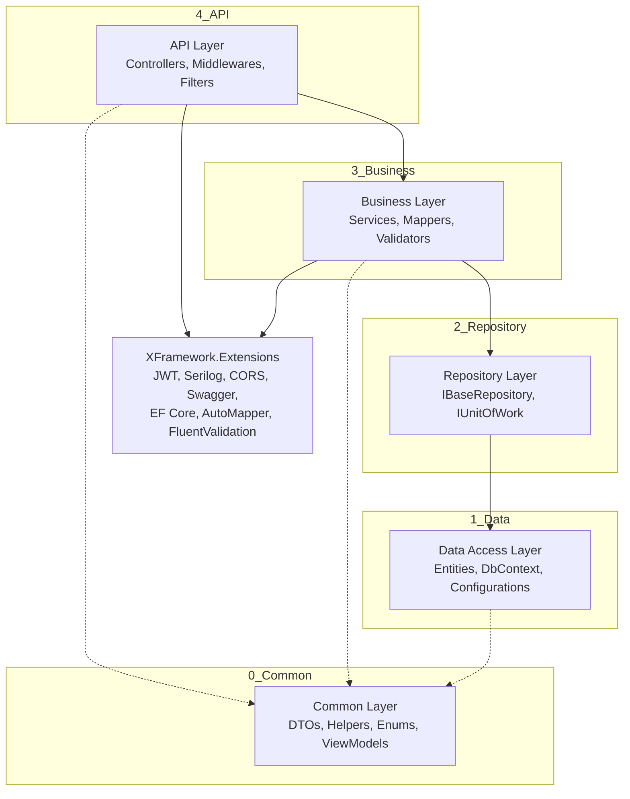

<p align="center">
  <h1 align="center">XFramework</h1>
  <p align="center">
    A starting point for building 5-layer ASP.NET Core Web APIs. Skip the boilerplate.
  </p>
</p>

[](https://www.nuget.org/packages/MCAkbayir.XFramework.Extensions)
[](https://www.nuget.org/packages/MCAkbayir.XFramework.Generator.Tool)
[](https://www.nuget.org/packages/MCAkbayir.XFramework.Template)

---

XFramework is a set of NuGet packages that wire up the common infrastructure you need in most ASP.NET Core Web API projects. It configures authentication, logging, validation, CORS, rate limiting, and Swagger with a single line of code. It comes with three packages: an infrastructure library, a `dotnet new` project template, and a separately installable CLI code generator.

If you find this project useful, please give it a star. Thanks! ⭐

## Why?

I found myself copying the same boilerplate across projects, so I extracted it into a package. XFramework is the result.

## Architecture



## Getting Started

Install the [.NET template](https://www.nuget.org/packages/MCAkbayir.XFramework.Template):

```
dotnet new install MCAkbayir.XFramework.Template
```

Create a new solution:

```bash
dotnet new xframework -n MyProject
cd MyProject
dotnet restore
dotnet build
```

That's it. The generated `Program.cs` is minimal. XFramework handles the rest:

```csharp
builder.Services.AddXFramework<MyAppContext, MyAppLogContext>(builder.Configuration);
builder.Services.AddBusinessServices(builder.Configuration);

app.UseXFramework(builder.Environment);
app.MapControllers();
```

Configure your `appsettings.json` and you're good to go:

```json
{
  "ConnectionStrings": {
    "DefaultConnection": "Server=.;Database=MyProjectDb;Trusted_Connection=True;TrustServerCertificate=True;",
    "LogConnection": "Server=.;Database=MyProjectLogDb;Trusted_Connection=True;TrustServerCertificate=True;"
  },
  "Jwt": {
    "Issuer": "MyProject",
    "Audience": "MyProjectClient",
    "Key": "SuperSecretKey-AtLeast32Characters!!",
    "ExpireInMinutes": 60
  },
  "Cors": {
    "PolicyName": "AllowSpecificOrigins",
    "AllowedOrigins": ["http://localhost:3000"],
    "AllowCredentials": true
  },
  "Cache": {
    "UserPageCacheMinutes": 5,
    "UserEndpointCacheMinutes": 10,
    "UseDistributed": false
  },
  "RateLimit": {
    "IpPermitLimit": 100,
    "IpWindowMinutes": 1,
    "UserPermitLimit": 50,
    "UserWindowMinutes": 1,
    "EnableRateLimiting": true
  },
  "Encryption": {
    "Key": "32-Character-Encryption-Key-Here!",
    "IV": "16CharacterIV!!!"
  },
  "RabbitMQ": {
    "Hostname": "localhost",
    "Username": "guest",
    "Password": "guest",
    "ExchangeName": "my_exchange",
    "QueueName": "my_queue",
    "RoutingKey": "my_routing_key"
  }
}
```

## Code Generator

Install the [CLI tool](https://www.nuget.org/packages/MCAkbayir.XFramework.Generator.Tool) to scaffold a full CRUD stack from a single entity:

```bash
dotnet tool install --global MCAkbayir.XFramework.Generator.Tool
```

```bash
xgen Product
```

This generates **DTOs**, **AutoMapper profile**, **FluentValidation validators**, **Service**, **Controller**, and a **DbSet entry**, all placed in the correct layers. You can skip specific components with `--skip`:

```bash
xgen Product --skip Mapper,Validator
```

## Project Structure

```
MyProject/
├── 0_Common/
│   ├── MyProject.Dtos/
│   └── MyProject.Helper/
├── 1_Data/
│   └── MyProject.DAL/
├── 2_Repository/
│   └── MyProject.Repository/
├── 3_Business/
│   └── MyProject.BLL/
├── 4_API/
│   └── MyProject.API/
└── MyProject.sln
```

## Technologies

* [ASP.NET Core 9](https://docs.microsoft.com/en-us/aspnet/core/introduction-to-aspnet-core)
* [Entity Framework Core 9](https://docs.microsoft.com/en-us/ef/core/) (SQL Server)
* [Serilog](https://serilog.net/) (Console + MSSQL with custom columns)
* [AutoMapper](https://automapper.org/)
* [FluentValidation](https://fluentvalidation.net/)
* [Swashbuckle](https://github.com/domaindrivendev/Swashbuckle.AspNetCore) (JWT-enabled Swagger UI)
* [MailKit](https://github.com/jstedfast/MailKit)
* [RabbitMQ.Client](https://www.rabbitmq.com/dotnet.html)

## Packages

| Package | Description |
|---------|-------------|
| [`MCAkbayir.XFramework.Extensions`](https://www.nuget.org/packages/MCAkbayir.XFramework.Extensions) | Infrastructure layer: JWT, Serilog, CORS, Swagger, EF Core, AutoMapper, FluentValidation, Rate Limiting, Exception & Logging Middlewares |
| [`MCAkbayir.XFramework.Generator.Tool`](https://www.nuget.org/packages/MCAkbayir.XFramework.Generator.Tool) | CLI scaffolding tool that generates DTOs, Mapper, Validators, Service, Controller, DbSet |
| [`MCAkbayir.XFramework.Template`](https://www.nuget.org/packages/MCAkbayir.XFramework.Template) | 5-layer project template for `dotnet new` |

## Prerequisites

* [.NET 9.0 SDK](https://dotnet.microsoft.com/download/dotnet/9.0)
* SQL Server instance

## License

This project is licensed under the [MIT License](LICENSE).